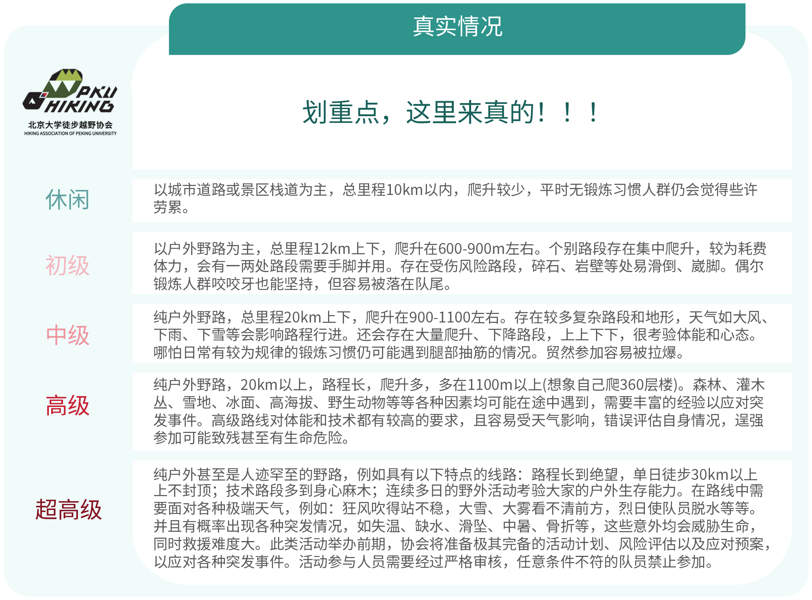
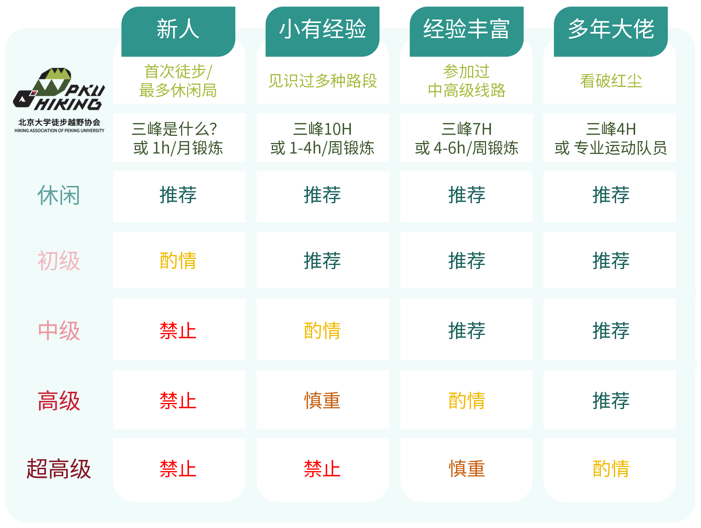

<p align="center">
  
</p>

<!-- <p align="center">
  <strong>徒步线路调研.skill</strong>
</p> -->

<p align="center">
  <strong style="font-size: 1.5rem;">徒步线路调研.skill</strong>
</p>

<p align="center">
  <a href="https://github.com/huolanmiao/trail-research-skill/blob/master/LICENSE"></a>
  <a href="https://github.com/huolanmiao/trail-research-skill/blob/master/LICENSE-docs"></a>
  <a href="https://github.com/huolanmiao/trail-research-skill"></a>
  <a href="#"></a>
</p>

---

> ## ⚠️ 免责声明（必读）
>
> 本工具生成的调研报告、领队计划、备案表、风险预案**仅为辅助性参考资料**，
> **不构成**任何户外活动的安全保障、专业意见或实施建议。户外徒步/越野存在
> 固有风险，**活动组织者和参与者应基于本人专业判断独立决策**，使用者**自担风险**。
> 本工具作者与贡献者**不对**使用其输出内容而产生的任何人身伤害、财产损失、
> 法律纠纷承担责任。完整声明见 [DISCLAIMER.md](DISCLAIMER.md)。

一个面向 **北京大学学生徒步越野协会** 及广大徒步爱好者的Agent Skill。输入模糊需求，自动完成路线推荐、全网深度调研、生成调研报告与正式活动文件（领队计划、备案表、风险预案）。

## 快速开始

在 Claude Code / Cursor / Codex / OpenClaw / Hermes 任一 AI 编程环境里配置skill：

```bash
npx skills add huolanmiao/trail-research-skill
```

命令会自动识别当前 agent 并把 skill 安装到对应目录。默认项目级安装，加 `-g` 切换到用户级：

| Agent | 用户级（`-g`） | 项目级（默认） |
|-------|---------------|---------------|
| Claude Code | `~/.claude/skills/trail-research/` | `.claude/skills/trail-research/` |
| Cursor / Codex | `~/.cursor/skills/` 或 `~/.codex/skills/` | `.agents/skills/trail-research/` |
| OpenClaw | `~/.openclaw/skills/` | `skills/trail-research/` |
| Hermes / 其他 | `~/.agents/skills/` | `.agents/skills/trail-research/` |

更新到最新版本：再跑一次同一命令加 `--force`；卸载：`npx skills remove huolanmiao/trail-research-skill`。

### Python 依赖

生成 .docx / .xlsx 需要 `python-docx` 和 `openpyxl`。**首次调用脚本时 skill 会自检并提示安装**，也可以现在预装：

```bash
pip install python-docx openpyxl
```

### 使用

在CLI Code Agent界面直接用自然语言触发，无需 `/` 命令：

```
帮我推荐一条北京周边初级难度的一日徒步路线
```

## 可选增强：配置小红书 MCP

调研阶段会大量参考小红书的路况贴、劝退贴。装上 **RedNote-MCP** 后，skill 能直接搜索小红书、抓取笔记全文，比靠 WebSearch 抓第三方转载效果好很多。不装也能用，skill 会自动降级到 WebSearch。

**三步摘要（详细版见 [`references/rednote-mcp-setup.md`](references/rednote-mcp-setup.md)）：**

```bash
# 1. 安装（前置：Node.js ≥ 16）
npm install -g rednote-mcp

# 2. 登录小红书（弹出浏览器扫码/账号登录一次）
rednote-mcp init
```

3. 在用户级 `settings.json`（Windows `C:\Users\<你>\.claude\settings.json`，macOS/Linux `~/.claude/settings.json`）顶层合并：

```jsonc
{
  "mcpServers": {
    "rednote": {
      "command": "rednote-mcp",
      "args": ["--stdio"]
    }
  }
}
```

然后**完全退出并重启 agent**，在新会话里确认 MCP 已连接（Claude Code 可输入 `/mcp` 查看；其他 agent 查阅各自文档）即可。

> 中国大陆用户需要能访问 xiaohongshu.com 的代理。Windows 下若启动报 `spawn ENOENT`、代理端口怎么设、Cookie 过期怎么续——详见 [`references/rednote-mcp-setup.md`](references/rednote-mcp-setup.md)。

### 让 agent 帮你自动完成配置

不想手工操作？在任何支持 skill 的 agent（Claude Code / Cursor / Codex / OpenClaw / Hermes）里粘贴下面这句，它会定位当前 skill 下的 `references/rednote-mcp-setup.md` 并按其中针对该 agent 的小节替你完成全部流程，只在扫码登录那一步停下等你：

```
请帮我配置 RedNote MCP。先在已安装的 trail-research skill 里找到 references/rednote-mcp-setup.md，按里面对应当前 agent 的 Step 3 小节操作；改配置文件前先备份；rednote-mcp init 登录那一步让我手动做，你不要替我跑。
```

## 运行模式

| 模式 | 触发示例 | 产出 |
|------|---------|------|
| **A：完整流程** | "调研北灵山徒步路线" | 调研报告 + 领队计划 + 备案表 + 风险预案 |
| **B：仅调研** | "只帮我查一下XX路线的路况" | 调研报告 (.md) |
| **C：仅生成文件** | "根据这份调研报告生成领队计划" | .docx + .xlsx |

## 交付物

所有文件统一输出到当前目录下的 `{路线名称}/` 文件夹：

| 文件 | 格式 | 说明 |
|------|------|------|
| 徒步线路调研报告 | `.md` | 14 章全面调研，含轨迹、路况、天气、交通、政策、风险、参考链接 |
| JSON 数据文件 | `.json` | 结构化路线数据，供脚本生成正式文件 |
| 领队计划 | `.docx` | 活动介绍、路线信息、组织事宜、物资准备、报名事项 |
| 活动备案表 | `.docx` | 路线简介至装备与注意事项五节主干内容 |
| 风险预案 | `.xlsx` | 标准风险矩阵 + 色标图例 |

## 路线分级体系

Skill 内置北大徒协标准路线分级算法，自动计算强度并评定等级：

<p align="center">
  
</p>

**标准强度 = 路程(km) + 爬升(m) / 100**

| 等级 | 强度范围 |
|------|----------|
| 休闲 | < 12 |
| 初级 | 12 ~ 20 |
| 中级 | 20 ~ 35 |
| 高级 | 35 ~ 50 |
| 超高级 | > 50 |

特殊路况（积雪、野长城、暴露感强、雨后烂泥、小陡崖、溯溪、踏冰、抱石）和重装会额外提升等级：

<p align="center">
  
</p>

## 调研维度

每次调研覆盖以下全部维度，各维度至少 2 次 WebSearch 交叉验证：

| 优先级 | 维度 | 关键搜索源 |
|--------|------|-----------|
| P0 | 轨迹数据 | 两步路、六只脚 |
| P0 | 起终点坐标 | GPS 坐标（可在地图搜索） |
| P0 | 近期路况 | 小红书（劝退/排雷/最新） |
| P0 | 路线开放情况 | 防火期、封山、管控通告 |
| P0 | 政策与证件 | 边防证、入山证、门票（当年） |
| P0 | 大交通时效 | 班车/火车/航班最新时刻 |
| P1 | 天气 | Windy、莉景天气 |
| P1 | 交通可达性 | 起点停车、公交、大巴可达 |
| P1 | City walk 专项 | 免费讲解、公共演出、学生票 |
| P2 | 补给与设施 | 水源、商店、信号覆盖 |

> 所有时效性信息（大交通、边防证、门票）强制搜索当前年份验证。

## 目录结构

```
~/.claude/skills/trail-research/
├── SKILL.md                              # 主技能定义
├── README.md
├── _shared/
│   └── user-config.json                  # 用户偏好配置
├── references/
│   ├── handbook.md                       # 北大徒协规范精要
│   ├── leader-handbook-full.md           # 领队手册完整版
│   ├── report-template.md                # 调研报告模板
│   ├── research-guide.md                 # 搜索策略指南
│   └── template-specs.md                 # 交付文件字段规格
├── scripts/
│   ├── data_model.py                     # 统一数据模型
│   ├── docx_utils.py                     # Word 文档工具
│   ├── generate_leader_plan.py           # 领队计划生成
│   ├── generate_registration_form.py     # 备案表生成
│   └── generate_risk_plan.py             # 风险预案生成
└── assets/
    ├── 徒协logo.png                      # 协会 Logo
    ├── 徒协logo横版.png                  # 协会 Logo（横版）
    ├── 路线分级1.png                     # 分级标准图
    └── 路线分级2.png                     # 分级调整规则图
```

## 技术架构

```
用户输入
  → AI Agent 加载 SKILL.md
    → Phase 1: 需求澄清（对话）
    → Phase 2: 路线推荐（WebSearch × N）
    → Phase 3: 深度调研（WebSearch × N）→ 产出调研报告 .md + JSON
    → Phase 4: 预览交互（对话确认）
    → Phase 5: Python 脚本 → .docx + .xlsx
```

## 信息源

| 平台 | 用途 |
|------|------|
| 两步路 (2bulu.com) | 轨迹数据、实拍照片 |
| 六只脚 (foooooot.com) | 轨迹数据 |
| 小红书 | 实时路况、排雷、攻略 |
| 微信公众号 | 商业团路线、深度攻略 |
| Windy / 莉景天气 | 山区天气、云海预测 |
| 游侠客 / 徒步中国 | 商业路线参考 |

## 依赖

- Code Agent 运行环境
- **Python 3.8+** — 脚本执行
- **python-docx** — Word 文档生成
- **openpyxl** — Excel 文档生成

## 更新

用户级安装：

```bash
cd ~/.claude/skills/trail-research/ && git pull
```

项目级安装：

```bash
cd <project>/.claude/skills/trail-research/ && git pull
# 若作为 submodule 引入：
git submodule update --remote .claude/skills/trail-research
```

## 参考来源

- [北大徒协领队手册](references/leader-handbook-full.md)（2026.4.20 版，内部共享链接已脱敏，原文请向徒协成员索取）
- [Agent Skills 规范](https://agentskills.io)
- [Claude Code Skills 开发指南](https://docs.anthropic.com/en/docs/claude-code/skills)

## 贡献

欢迎提 Issue 和 PR。提交前请阅读：

- [CONTRIBUTING.md](CONTRIBUTING.md) — 贡献流程、DCO 签名要求
- [CODE_OF_CONDUCT.md](CODE_OF_CONDUCT.md) — 行为准则（Contributor Covenant 2.1）

## License

本仓库采用**双 License**：

| 范围 | License | 说明 |
|------|---------|------|
| 代码（`SKILL.md`, `scripts/`, 模板脚本、工程文件） | [Apache License 2.0](LICENSE) | 允许商用/修改/分发，含专利授权条款 |
| 文档与资源（`README.md`, `DISCLAIMER.md`, `references/`, `assets/`, 配置样例等） | [CC BY-NC-SA 4.0](LICENSE-docs) | 署名 + 非商用 + 相同协议共享 |

第三方内容的归属和说明见 [NOTICE](NOTICE)。**"北京大学学生徒步越野协会"名称与 logo
归协会所有**，本项目对其使用限于标注资料来源，不构成任何背书或隶属关系。

免责声明见 [DISCLAIMER.md](DISCLAIMER.md)——使用本工具前请完整阅读。

---

<p align="center">
  <sub>北京大学学生徒步越野协会 · 与君携手，共赴山河</sub>
</p>
